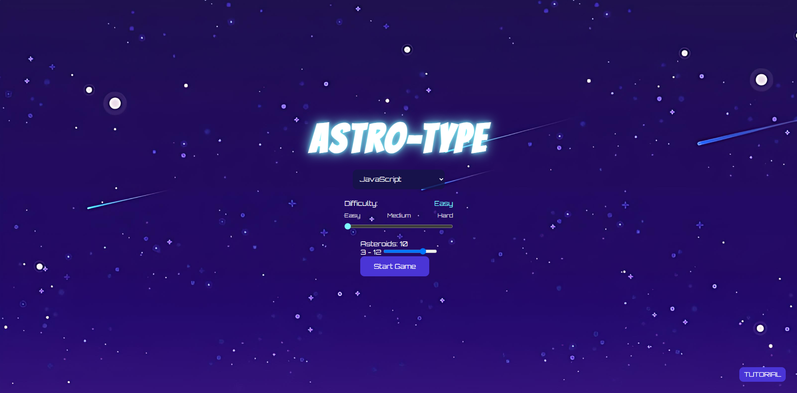
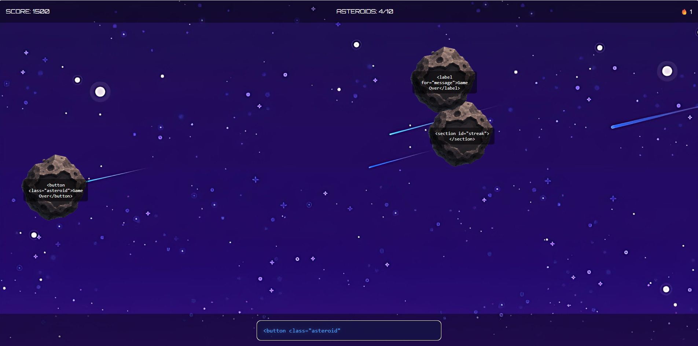
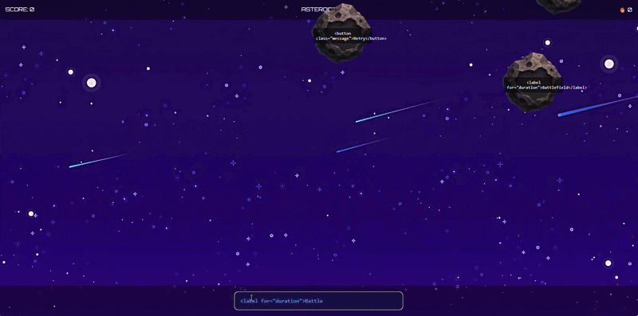
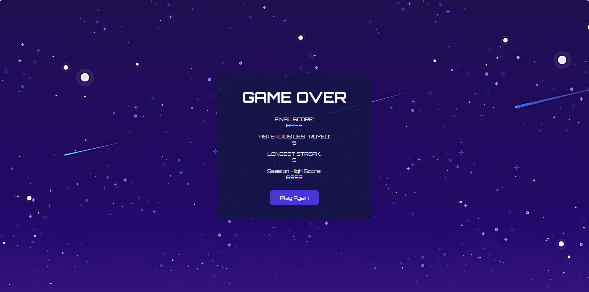

### cse110-sp26-group21
[Team Page](/admin/team.md)

[Status Video 1](https://youtu.be/RvWl4o17yyw)

[Final Project Video (Private)](https://youtu.be/MHX47ivT7MY)

[Final Project Video (Public)](https://www.youtube.com/watch?v=e6TZ7nOyToE)
--- 

# ASTRO-TYPE 
## Play Here! 
https://cse110-sp26-group21.github.io/cse110-sp26-group21/

### Description 
Astro-Type is a web-based typing game designed to help beginner programmers practice coding in JavaScript, HTML, and CSS. Players must type out falling code snippets attached to incoming asteroids before they reach the bottom of the screen. The game combines interactive gameplay with coding practice to make learning programming syntax more engaging and fun.

### Goal 
The goal of Astro-Type is to improve users' coding fluency and typing accuracy through an interactive game experience. By repeatedly typing real programming syntax under time pressure, players strengthen their familiarity with JavaScript, HTML, and CSS while developing faster recognition of common coding patterns. The project aims to make learning programming fundamentals more enjoyable, accessible, and motivating for beginners.

### Tech Stack
- HTML
- CSS
- JavaScript

### Getting Started 
1. `git clone https://github.com/cse110-sp26-group21/cse110-sp26-group21.git`
2. `cd cse110-sp26-group21`
3. Open index.html with Live Server

### Contributing 
1. Make new branch
2. Stage and commit changes
3. git push -u origin branch-name (set up tracking for your branch)
4. Open Pull Request following [PR template](/.github/pull_request_template.md)
5. Request review from teammate
6. Merge if passes all checks

### Gameplay





### Repo-Structure
```
└── 📁cse110-sp26-group21
    └── 📁.github
        └── 📁ISSUE_TEMPLATE
            ├── issue-template.md
        └── 📁workflows
            ├── main.yml
        ├── pull_request_template.md
    └── 📁admin
        └── 📁branding
            └── 📁files
                ├── color-palette.png
                ├── logo-badge.png
                ├── logo-badge.svg
                ├── logo-primary.png
            └── 📁teamvid
                ├── link
            ├── branding.md
            ├── team-21-deck.pptx
        └── 📁decisions
            ├── 0001-use-eslint.md
            ├── 0002-use-jsdoc.md
            ├── 0003-use-vitest.md
            ├── 0004-use-phaser.md
            ├── 005-use-SPA.md
            ├── adr-template.md
        └── 📁feedback
            ├── feedback-22.md
            ├── feedback-23.md
        └── 📁meetings
            ├── 041126-kickoff.md
            ├── 041926-warmup2.md
            ├── 050926-sprint1.md
            ├── 051126-sprint2.md
            ├── 051826-sprint3.md
            ├── 052626-sprint4.md
            ├── 060126-sprint5.md
            ├── 060526-sprint6.md
            ├── meetings.md
            ├── reflection1.md
            ├── reflection2.md
        └── 📁misc
        └── 📁planning
            ├── journey-mapping.md
            ├── MVP.md
            ├── research.md
            ├── user-stories.md
        └── 📁standups
            ├── 050726-standup.md
            ├── 051026-standup.md
            ├── 051726-standup.md
            ├── 052626-standup.md
            ├── 060126-standup.md
        └── 📁videos
            ├── link.md
            ├── statusvideo1.mp4
            ├── team-intro.mp4
        ├── team.md
    └── 📁assets
        └── 📁images
            ├── asteroid.png
            ├── explosion.gif
            ├── space-background.png
        └── 📁snippets
            ├── css.json
            ├── html.json
            ├── javascript.json
    └── 📁docs
    └── 📁prototype
        └── 📁src
            └── 📁asteroids
            └── 📁phaser
            └── 📁questions
            └── 📁scoring
            └── 📁screens
            └── 📁stats
            └── 📁typing
            └── 📁utils
            ├── appState.js
            ├── config.js
            ├── main.js
        └── 📁styles
        └── 📁tests
        ├── index.html
    └── 📁scripts
        ├── asteroids.js
        ├── game.js
        ├── main.js
        ├── snippets.js
        ├── tutorial.js
        ├── typing.js
    └── 📁testing
        ├── asteroids.test.js
        ├── e2e.test.js
        ├── game.test.js
        ├── snippets.test.js
        ├── typing.test.js
    ├── .gitignore
    ├── CHANGELOG.md
    ├── eslint.config.mjs
    ├── index.html
    ├── package-lock.json
    ├── package.json
    ├── README.md
    ├── style.css
    └── vitest.config.js
```
