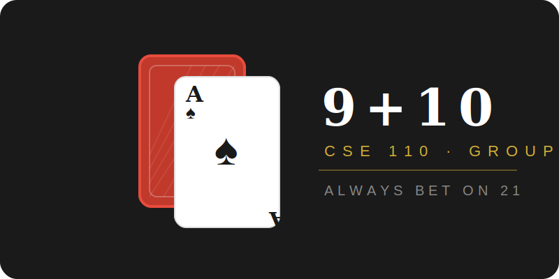
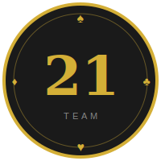
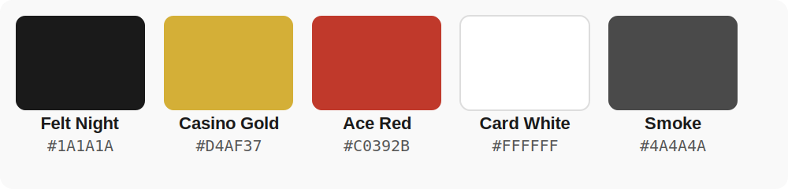

# Team 9+10 — Brand Guide
### CSE 110 Software Engineering · Group 21

> *"Always bet on 21."*

---

## Table of Contents
- [Team 9+10 — Brand Guide](#team-910--brand-guide)
    - [CSE 110 Software Engineering · Group 21](#cse-110-software-engineering--group-21)
  - [Table of Contents](#table-of-contents)
  - [Team Identity](#team-identity)
  - [Logo](#logo)
    - [Primary Logo](#primary-logo)
  - [Color Palette](#color-palette)
    - [Accent Text Style](#accent-text-style)
    - [Suit Symbols as Decorative Elements](#suit-symbols-as-decorative-elements)
  - [Mascot](#mascot)
    - [The Dealer 🃏](#the-dealer-)
  - [Taglines](#taglines)
  - [Usage](#usage)

---

## Team Identity

| Field | Value |
|---|---|
| **Team Name** | 9 + 10 |
| **Group Number** | 21 |
| **Course** | CSE 110 — Software Engineering |
| **Theme** | Blackjack / Casino |
| **Primary Tagline** | *Always bet on 21.* |

The name **9+10** is a direct reference to our group number (21) dressed up as a blackjack hand — clean, clever, and instantly memorable. Our brand leans into the casino aesthetic: sharp contrasts, gold accents, and the composure of a player who always knows their odds.

---

## Logo



### Primary Logo


The primary logo features overlapping playing cards (an ace of spades in front) alongside the team wordmark. Use this on slide covers, documents, and anywhere you need the full brand presence.


The badge variant centers the number **21** in Casino Gold inside a circular ring with the four card suits at cardinal points. Use this as a compact icon — GitHub profile, document headers, footers, or anywhere space is tight.

---

## Color Palette



| Name | Hex | Usage |
|---|---|---|
| **Felt Night** | `#1A1A1A` | Backgrounds, dark slides, primary surfaces |
| **Casino Gold** | `#D4AF37` | Accents, highlights, headings on dark bg |
| **Ace Red** | `#C0392B` | Emphasis, warnings, heart/diamond suits |
| **Card White** | `#FFFFFF` | Body text on dark, light backgrounds |
| **Smoke** | `#4A4A4A` | Secondary text, muted elements, borders |


### Accent Text Style
For callout labels and accent elements, use **uppercase + letter-spacing**:
```
font-weight: 500;
letter-spacing: 0.2em;
text-transform: uppercase;
color: #D4AF37;
```

### Suit Symbols as Decorative Elements
The four suits can be used as bullet replacements or section dividers:
- ♠ Spades — primary bullets / section headers
- ♥ Hearts — secondary bullets / highlights  
- ♦ Diamonds — tertiary / callouts
- ♣ Clubs — footnotes / misc

---

## Mascot

### The Dealer 🃏

The team mascot is **The Dealer** — a cool, composed card dealer who always knows the odds. Sharp suit, sharper code.

**Personality traits:**
- Calculated and methodical — never goes bust
- Confident but not arrogant — knows when to stand
- Always two sprints ahead — thinking about the next hand

---

## Taglines

| Tagline | Tone | Best Used For |
|---|---|---|
| *"Always bet on 21."* | Bold, confident | Primary tagline — slide covers, repo README |
| *"Hit, stand, ship."* | Dev-focused, punchy | Sprint demos, release notes |
| *"The house always codes."* | Playful | Casual slides, team intros |
| *"9 + 10. Never bust."* | Self-referential | Team bios, icebreaker slides |

---

## Usage
- Use the logo on every slide cover and major document header
- Apply Casino Gold sparingly as an accent color
- Use Georgia serif for all display/heading text in presentations
- Include the suit symbols (♠ ♥ ♦ ♣) as decorative accents or bullet replacements
- Keep slide backgrounds Felt Night (`#1A1A1A`) for a consistent look


*Team 9+10 · CSE 110 · Group 21 · Always bet on 21. ♠*
